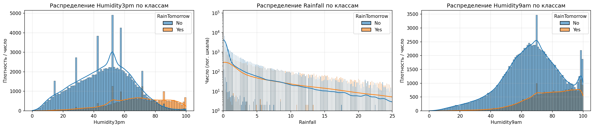
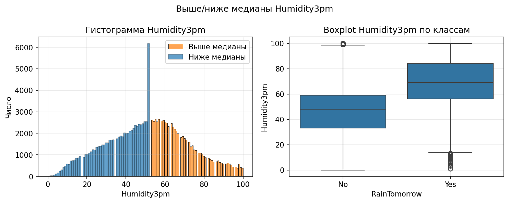
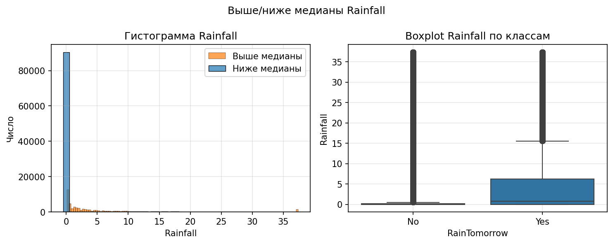
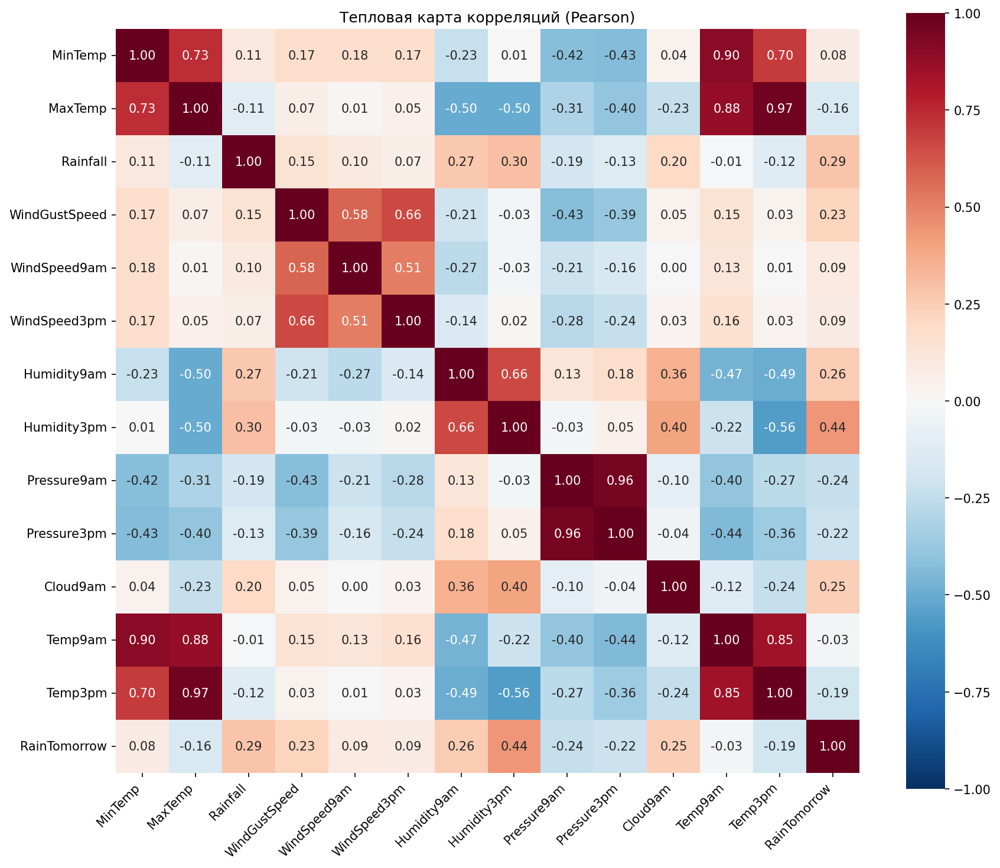
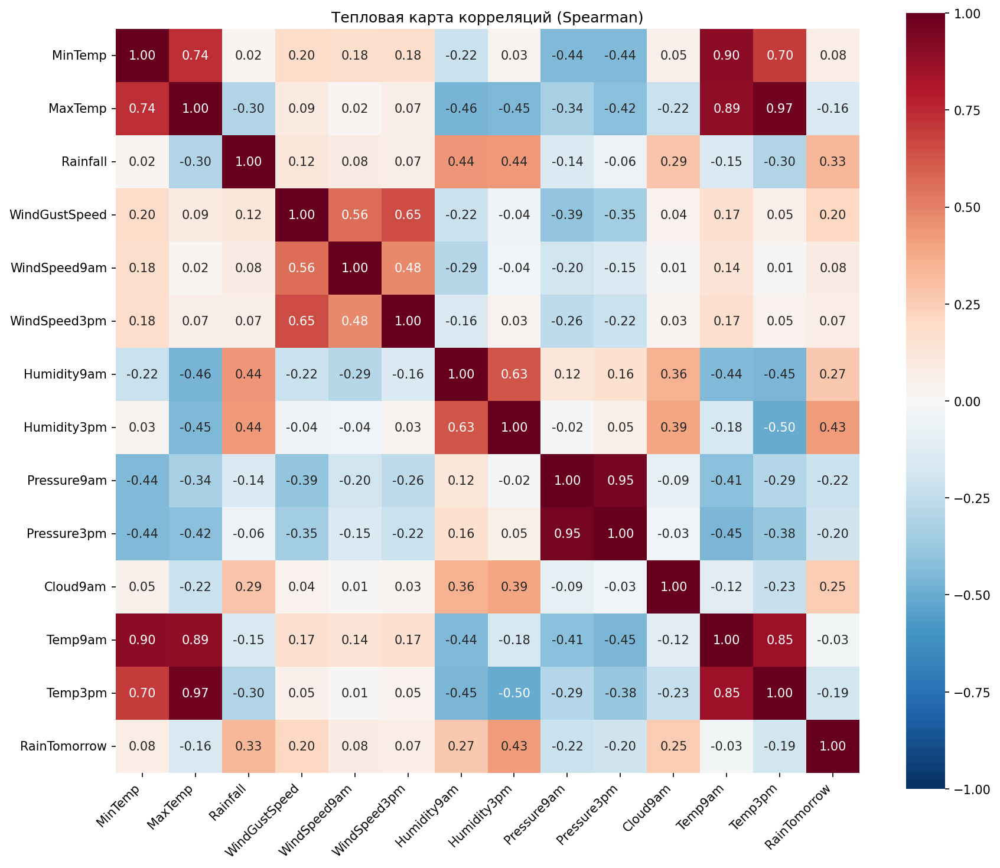
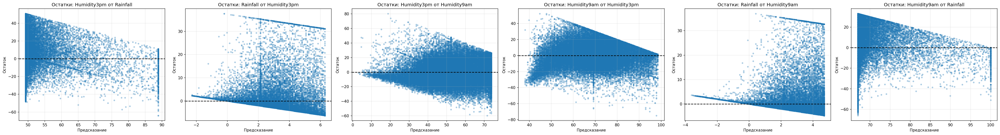
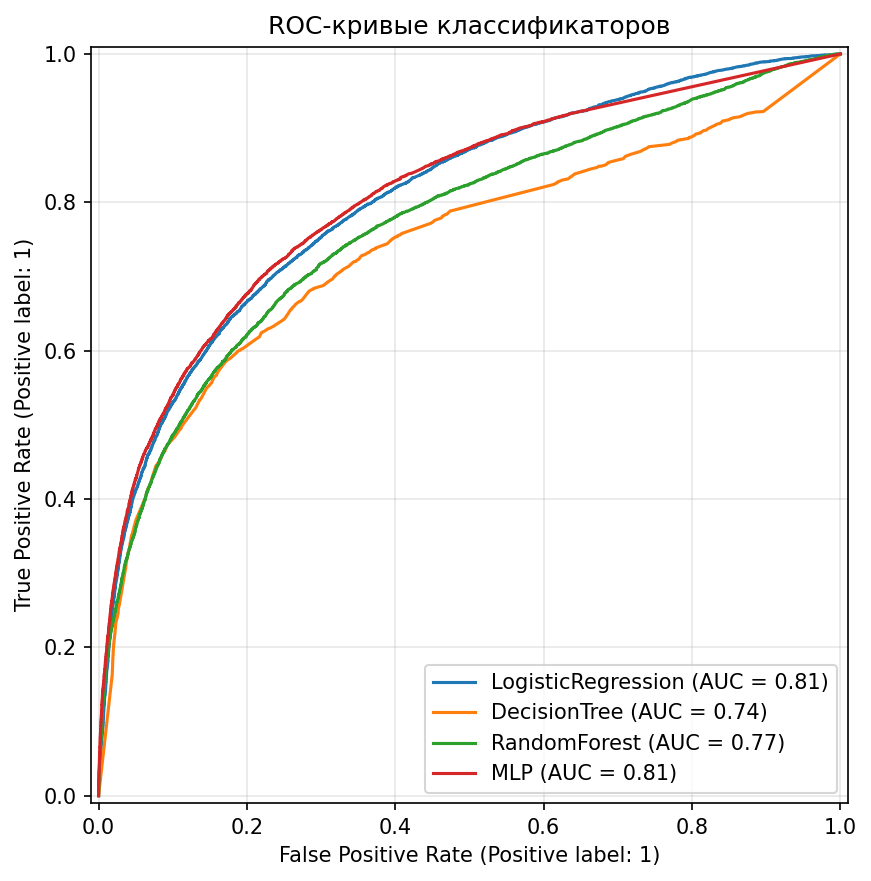
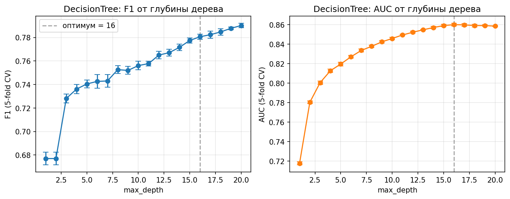

# Курсовая работа. Статистический анализ и моделирование данных на примере базы данных «Rain in Australia»

*(Титульный лист оформляется отдельно по требованиям кафедры.)*

---

## 1. Введение

### 1.1. Тема и цель работы

**Тема:** Статистический анализ и моделирование данных на основе выборки с параметрами n, m и целевой переменной на примере базы данных «Rain in Australia».

**Цель:** Освоить полный цикл анализа данных — от первичного осмотра и визуализации до применения многомерных статистических методов и интерпретации результатов.

### 1.2. Выбор датасета и параметров

В работе использован датасет **Rain in Australia**: ежедневные метеонаблюдения по Австралии (2007–2017, 49 локаций). Файл `weatherAUS.csv` взят с [Kaggle](https://www.kaggle.com/datasets/jsphyg/weather-dataset-rattle-package).

В качестве параметров n и m выбраны:
- **n — Humidity3pm** (влажность в 15:00, %). Отражает текущее состояние влажности и хорошо связана с вероятностью дождя на следующий день.
- **m — Rainfall** (осадки за день, мм). Прямой индикатор осадков; часто в дни перед «дождём завтра» уже есть ненулевые осадки.

**Целевая переменная** — RainTomorrow (Yes/No): будет ли дождь завтра. Классы несбалансированы: примерно 78% No и 22% Yes, что типично для задач предсказания редких событий.

Для корреляций, регрессии и классификации привлекались и другие числовые признаки (температура, давление, скорость ветра). Категориальные (Location, направление ветра) в моделях не использовались: у Location 49 уникальных значений, что дало бы слишком много столбцов при кодировании; фокус сделан на числовых признаках.

### 1.3. Инструменты и структура проекта

Всё реализовано на **Python**. Код разбит по модулям так, чтобы один файл отвечал за одну задачу: загрузка и очистка — `data.py`, графики — `viz.py`, корреляции — `correlation.py`, регрессия — `regression.py`, ANOVA — `anova.py`, классификаторы — `classifier.py`, общие функции — `utils.py`. Запуск всего пайплайна из корня репозитория:

```bash
python -m course_work.main
```

При интерпретации результатов использовалась идея уровней аналитики по Морроу [Дж. Морроу. Как вытащить из данных максимум. Навыки аналитики для неспециалистов, 2022]: описательный («что произошло»), диагностический («почему») и предсказательный («что будет»).

---

## 2. Часть 1. Подготовительный этап и разведочный анализ (EDA)

### 2.1. Задание 1. Первичная обработка данных

**Что за данные.** В таблице — ежедневные метеозаписи: числовые столбцы (температуры, влажность, осадки, давление, скорость ветра и т.д.) и категориальные (Location, направление ветра, RainToday, RainTomorrow). Для влажности и осадков заданы естественные ограничения: влажность 0–100%, осадки неотрицательны; значения выше 300 мм по Rainfall считаем экстремальными аномалиями (редкие ливни), а не ошибкой.

**Проверка качества.** Сначала смотрим пропуски, дубликаты и явные аномалии. Загрузка с учётом того, что в CSV пропуски помечены как «NA»:

```python
def load_raw_data() -> pd.DataFrame:
    return pd.read_csv(FILE_CSV, na_values=["NA"], keep_default_na=True)
```

Пропуски считаются по каждому столбцу (количество и процент), дубликаты — по полным строкам. Отдельно проверяются аномалии: Rainfall &lt; 0 или &gt; 300 мм, Humidity3pm вне [0, 100], отрицательные скорости ветра (минимальная температура может быть отрицательной — это нормально, а вот скорость ветра &lt; 0 — ошибка):

```python
anom_rain = (df["Rainfall"] < 0) | (df["Rainfall"] > 300)
anom_hum = df["Humidity3pm"].notna() & (
    (df["Humidity3pm"] < 0) | (df["Humidity3pm"] > 100)
)
# для ветра — цикл по WindGustSpeed, WindSpeed9am, WindSpeed3pm
```

**Стратегия обработки.** Столбцы с долей пропусков больше 40% удалены (Evaporation, Sunshine, Cloud3pm; у Cloud9am было 38,4%, порог не достигнут). Строки без значения целевой переменной отброшены. Дату переводим в datetime для возможного учёта сезонности. Числовые пропуски заполняем медианой, категориальные (направление ветра, RainToday) — модой. Отрицательные скорости ветра заменяем на 0. Затем удаляем только *экстремальные* аномалии (Rainfall вне [0, 300], Humidity3pm вне [0, 100]) — таких строк немного.

Важный момент — **выбросы**. Для погодных данных классическое удаление по правилу 1.5×IQR по Rainfall привело бы к потере около 20% выборки и к тому, что почти все дни с дождём оказались бы «выбросами» (у них Rainfall выше верхней границы IQR). Поэтому вместо удаления строк использован **winsorize**: значения за границей не удаляются, а подставляются граничные. Для Rainfall — ограничение сверху по 99-му перцентилю (нижняя граница 0), для Humidity3pm — по границам 1.5×IQR:

```python
# utils.py
def winsorize_rainfall(series, upper_percentile=99.0):
    return series.clip(lower=0, upper=series.quantile(upper_percentile / 100))

def winsorize_iqr(series, factor=1.5):
    q1, q3 = series.quantile(0.25), series.quantile(0.75)
    iqr = q3 - q1
    low, high = q1 - factor * iqr, q3 + factor * iqr
    return series.clip(lower=low, upper=high)
```

В `clean_data` это вызывается так:

```python
df["Rainfall"] = winsorize_rainfall(df["Rainfall"], upper_percentile=99.0)
df["Humidity3pm"] = winsorize_iqr(df["Humidity3pm"], factor=1.5)
```

После очистки выводится баланс классов, чтобы убедиться, что распределение целевой не искажено.

**Результаты и выводы по заданию 1.** По результатам запуска программы получено следующее.

Исходный объём данных: **145 460 строк, 23 столбца**. Проверка пропусков показала, что больше всего пропусков у Sunshine (48,0%), Evaporation (43,2%), Cloud3pm (40,8%); у Cloud9am — 38,4%. Удалены три столбца с долей пропусков выше 40%: Evaporation, Sunshine, Cloud3pm. Полных дубликатов строк не обнаружено (0). Аномалий по Rainfall (отрицательные или &gt;300 мм) найдено 2 строки, по Humidity3pm вне диапазона [0, 100] — 0.

После удаления строк с пропуском в RainTomorrow осталось **142 193 строки**. Удаление экстремальных аномалий (Rainfall &lt; 0 или &gt; 300 мм, Humidity3pm вне [0, 100]) убрало **1 408 строк**. Итоговый размер выборки: **140 785 строк, 20 столбцов**. Пропуски после импутации медианой (числовые) и модой (категориальные) отсутствуют (0).

Баланс классов после очистки: **No — 77,84%**, **Yes — 22,16%**, что соответствует исходной пропорции (~22–23% дождливых дней) и подтверждает, что выбранная стратегия (winsorize вместо массового удаления по IQR) не исказила целевую переменную.

По описательной статистике (describe): средняя влажность в 15:00 (Humidity3pm) около 51,5%, медиана 52%; осадки (Rainfall) имеют сильную правостороннюю асимметрию (медиана 0, среднее около 2,08 мм, максимум после winsorize 37,4 мм). Температуры, давление и скорость ветра находятся в ожидаемых диапазонах.

**Вывод по заданию 1.** Первичная обработка выполнена без существенной потери данных: удалено около 3% строк в основном за счёт экстремальных аномалий и пропусков в целевой переменной. Распределение целевой переменной сохранено, пропуски устранены. Выбранный способ обработки выбросов (winsorize) позволил сохранить информативность признака Rainfall и долю класса Yes для последующего моделирования.

*В терминах Морроу: первичная обработка — основа диагностического уровня аналитики («почему данные такие»); понимание источников пропусков и выбросов задаёт корректную интерпретацию дальнейших этапов.*

### 2.2. Задание 2. Визуализация и описательная статистика

Построены распределения параметров **n** (Humidity3pm) и **m** (Rainfall) с разбивкой по классам RainTomorrow. Используется гистограмма с сглаживанием (KDE), подписи осей, легенда и сетка:

```python
sns.histplot(data=df, x=COL_N, hue=COL_TARGET, kde=True, ax=axes[0], alpha=0.6)
# аналогично для Rainfall (COL_M)
```

По ним видно: для дней с дождём завтра (Yes) влажность в 15:00 чаще смещена вправо (70–90%), а осадки сегодня — ненулевые; для No — влажность ближе к 50–60%, осадки часто 0. То есть оба признака уже на уровне описаний помогают разделять классы.

Медиана, среднее и стандартное отклонение для n и m считаются по всей выборке и по каждому классу (например, через `groupby(COL_TARGET)[col].agg(["mean", "median", "std"])`), результат выводится в консоль.

Далее — разбивка «выше медианы» и «ниже медианы» по n и по m. Для каждой такой подвыборки строятся гистограмма, scatter (n vs m, точки окрашены по тому, выше или ниже медианы значение выбранного признака) и boxplot по классам RainTomorrow. Отдельно печатается СКО выше и ниже медианы — например, для Rainfall СКО выше медианы обычно больше из‑за редких сильных осадков.

Оценка сбалансированности — доля No и Yes (bar и pie). Это важно для интерпретации метрик классификации: при 78/22 модель может «подстраиваться» под класс No; поэтому дальше используются F1, Recall и AUC и при необходимости SMOTE и `class_weight='balanced'`.



*Рисунок 1 — Распределения Humidity3pm (n) и Rainfall (m) по классам RainTomorrow.* Два подграфика: слева — гистограмма с KDE для Humidity3pm (ось X — влажность в %, ось Y — плотность/число наблюдений), справа — то же для Rainfall (ось X — осадки в мм). Цветом выделены классы RainTomorrow (No / Yes). График строится через `seaborn.histplot(..., hue=RainTomorrow, kde=True)`. Показывает, как распределены n и m в группах «дождь завтра» и «без дождя».



*Рисунок 2 — Разбивка по медиане Humidity3pm: гистограмма, scatter (n vs m), boxplot по классам.* Слева: гистограмма Humidity3pm, столбцы окрашены по тому, выше или ниже медианы значение. В центре: scatter — по оси X Humidity3pm, по Y Rainfall; точки окрашены по тому, выше/ниже медианы влажность. Справа: boxplot — по оси X классы RainTomorrow, по Y Humidity3pm. Показывает связь влажности с осадками и различия распределения n по целевой переменной.



*Рисунок 3 — Разбивка по медиане Rainfall.* Аналогично рис. 2, но разбивка по медиане осадков: гистограмма Rainfall (X — мм, цвет — выше/ниже медианы), scatter n vs m (цвет по медиане Rainfall), boxplot Rainfall по классам RainTomorrow. Показывает, как осадки связаны с влажностью и как распределение m различается по классам «дождь завтра» / «нет».


*Рисунок 4 — Баланс классов целевой переменной.* Слева — столбчатая диаграмма: по оси X значения RainTomorrow (No, Yes), по Y — число наблюдений. Справа — круговая диаграмма с долями классов в процентах. Строится по подсчёту `value_counts()` и отображению через barplot и pie. Показывает дисбаланс классов (примерно 78% No, 22% Yes).

**Результаты и выводы по заданию 2.** По результатам запуска получены следующие значения описательной статистики и визуализации.

**Описательная статистика.** По всей выборке: Humidity3pm — среднее 51,46%, медиана 52%, СКО 20,55; Rainfall — среднее 2,08 мм, медиана 0 мм, СКО 5,86. По классам RainTomorrow для **Humidity3pm**: при No — среднее 46,62%, медиана 48%, СКО 18,29; при Yes — среднее 68,47%, медиана 69%, СКО 18,92. То есть в дни перед дождём влажность в 15:00 в среднем заметно выше (около 68% против 47%), распределения по классам хорошо разделяются. Для **Rainfall**: при No — среднее 1,18 мм, медиана 0 мм, СКО 4,13; при Yes — среднее 5,24 мм, медиана 0,8 мм, СКО 9,09. В дни перед дождём осадки сегодня в среднем выше; у класса No медиана 0 (большинство дней без осадков), у Yes — 0,8 мм, при этом разброс (СКО) у Yes больше из‑за редких сильных дождей.

**Разбивка по медиане.** Медиана Humidity3pm = 52%. СКО выше медианы 12,09, ниже медианы 12,49 — разброс примерно одинаков. Медиана Rainfall = 0 мм (большинство наблюдений — нулевые осадки). СКО выше медианы 8,62, ниже медианы 0 (все значения ниже медианы равны 0), что подчёркивает сильную правостороннюю асимметрию распределения осадков.

**Графики.** На рис. 1 по Humidity3pm видно смещение распределения класса Yes вправо (пик около 70–80%) по сравнению с No (пик около 40–55%) — признак n хорошо различает классы. По Rainfall оба класса имеют пик на нуле, но у Yes распределение заметно тянется вправо до ~37 мм; ненулевые осадки чаще сопутствуют предсказанию «дождь завтра». На рис. 2 и 3 (выше/ниже медианы) видно: при влажности выше медианы осадки чаще ненулевые и выше; при осадках выше медианы — типичная картина редких дождливых дней. Boxplot по классам (рис. 2 и 3) подтверждает: у RainTomorrow=No влажность и осадки в основном ниже, у Yes — медианы и квантили выше. На рис. 4 баланс классов: No около 77,8%, Yes около 22,2%, что соответствует выводу задания 1.

**Вывод по заданию 2.** Визуализация и описательная статистика показывают, что оба признака (Humidity3pm и Rainfall) содержательны для предсказания RainTomorrow: более высокая влажность и ненулевые осадки сегодня связаны с классом Yes. Сильная асимметрия Rainfall (медиана 0, высокое СКО у Yes) и несбалансированность классов учтены при дальнейшем построении моделей (метрики F1, AUC, балансировка).

---

## 3. Часть 2. Моделирование и прогнозирование

### 3.1. Задание 3. Корреляционный анализ

По числовым признакам построены тепловые карты корреляций — отдельно по Пирсону и по Спирмену. Пирсон уместен для признаков, близких к нормальному распределению; Спирмен устойчивее к скошенности (например, у Rainfall много нулей и длинный правый хвост). Целевая переменная для корреляции кодируется как 0/1 (No/Yes), чтобы можно было смотреть связь признаков с целью.

```python
# бинаризация цели для корреляции
numeric[COL_TARGET] = (df[COL_TARGET] == "Yes").astype(int)
corr = num_df.corr(method="pearson")  # или method="spearman"
sns.heatmap(corr, annot=True, fmt=".2f", ...)
```

Пары с |r| > 0.8 выводятся в консоль (мультиколлинеарность); при множественной регрессии их можно учесть через VIF. По картам видно, какие признаки сильнее связаны с влажностью, осадками и с целевой — это уже диагностический уровень: «почему» одни переменные двигаются вместе с другими.



*Рисунок 5 — Тепловая карта корреляций Пирсона.* Квадратная матрица: по осям X и Y — числовые признаки (включая RainTomorrow в виде 0/1). В ячейке (i, j) — коэффициент корреляции Пирсона между признаками i и j; цвет от синего (отрицательная связь) через белый (0) к красному (положительная). Строится по `df.corr(method="pearson")` и `sns.heatmap(..., annot=True)`. Показывает силу и знак линейной связи между всеми парами признаков и с целевой переменной.



*Рисунок 6 — Тепловая карта корреляций Спирмена.* Та же структура, что и на рис. 5: оси — признаки, ячейки — ранговые коэффициенты Спирмена (устойчивы к выбросам и скошенности). Строится по `df.corr(method="spearman")` и heatmap. Показывает монотонную связь между признаками; для скошенных переменных (например, Rainfall) Спирмен часто информативнее Пирсона.

**Результаты и выводы по заданию 3.** По результатам запуска получены матрицы корреляций Пирсона и Спирмена по всем числовым признакам и целевой RainTomorrow (кодирована как 1=Yes).

**Связь с целевой RainTomorrow.** Сильнее всего с целью связаны выбранные параметры: **Humidity3pm** — Пирсон 0,442, Спирмен 0,425 (умеренная положительная связь: выше влажность в 15:00 — чаще дождь завтра); **Rainfall** — Пирсон 0,287, Спирмен 0,332 (слабо–умеренная положительная связь; Спирмен выше Пирсона из‑за скошенности распределения осадков). Среди остальных признаков: положительная связь с целью у Humidity9am (Пирсон 0,26, Спирмен 0,27), Cloud9am (0,25 и 0,25), WindGustSpeed (0,23 и 0,20); отрицательная — у Pressure9am (−0,24 и −0,22), Pressure3pm (−0,22 и −0,20), Temp3pm (−0,19 и −0,19), MaxTemp (−0,16 и −0,16). MinTemp, WindSpeed9am, WindSpeed3pm, Temp9am с целью связаны слабо (коэффициенты близки к нулю).

**Мультиколлинеарность (|r| > 0,8).** Выявлены пары: MaxTemp — Temp3pm (r = 0,97), Pressure9am — Pressure3pm (r = 0,96), MinTemp — Temp9am (r = 0,90), MaxTemp — Temp9am (r = 0,88), Temp9am — Temp3pm (r = 0,85). Они несут сходную информацию; при множественной регрессии имеет смысл учитывать это (например, через VIF или отбор признаков).

**Тепловые карты (рис. 5 и 6).** На карте Пирсона (рис. 5) видно: наиболее тёплые по тону ячейки с RainTomorrow — у Humidity3pm и Rainfall; холодные (отрицательные) — у давления и температуры днём. На карте Спирмена (рис. 6) картина похожа, при этом для Rainfall связь с целью сильнее (0,33 против 0,29 по Пирсону), что согласуется с устойчивостью ранговой корреляции к выбросам и асимметрии. Диагональные блоки температур (MinTemp, MaxTemp, Temp9am, Temp3pm) и давлений (Pressure9am, Pressure3pm) выделяются сильными взаимными корреляциями — наглядное подтверждение мультиколлинеарности.

**Вывод по заданию 3.** Параметры n (Humidity3pm) и m (Rainfall) обоснованно выбраны как наиболее информативные для целевой переменной среди числовых признаков. Корреляции с целью умеренные, что допускает использование этих признаков и в регрессии, и в классификации. Выявленная мультиколлинеарность между температурами и между давлениями учтена при интерпретации моделей (задание 4) и при использовании полного набора признаков в классификаторах (задание 7).

### 3.2. Задание 4. Регрессионный анализ

Построены две простые линейные регрессии: (1) предсказание n (Humidity3pm) по m (Rainfall); (2) предсказание m (Rainfall) по n (Humidity3pm). Разбиение — 70% обучающая / 30% тестовая с сохранением доли классов (stratify=RainTomorrow), чтобы в тесте оставалась та же пропорция Yes/No.

```python
X_tr, X_te, y_tr, y_te = train_test_split(
    X, y, test_size=0.3, random_state=RANDOM_STATE, stratify=stratify
)
lr = LinearRegression().fit(X_tr, y_tr)
# метрики: R², MSE, RMSE
# значимость коэффициентов — через statsmodels OLS (add_constant + fit)
```

Для каждой регрессии считаются R² (на train и test), MSE и RMSE на тесте, а также p-value коэффициентов (OLS из statsmodels). Дополнительно строится график остатков (предсказание по оси X, остаток по Y): по нему можно судить о том, насколько линейная модель адекватна (разброс вокруг нуля, отсутствие явного «конуса» или тренда).

R² для обеих регрессий получается невысоким (порядка 0.05–0.15): связь между влажностью и осадками есть, но не линейная. Это нормально для таких данных и показывает ограничение простой линейной модели — предсказательный уровень по Морроу как раз и выявляет, насколько мы можем «предсказать» одну величину по другой в рамках линейной гипотезы.



*Рисунок 7 — Остатки: n от m и m от n.* Два scatter-графика: по оси X — предсказанные значения (ŷ), по оси Y — остаток (y − ŷ). Слева — регрессия Humidity3pm от Rainfall, справа — Rainfall от Humidity3pm. Горизонтальная пунктирная линия на нуле — эталон «идеального» предсказания. Строится по предсказаниям модели на тестовой выборке и разности с фактическими значениями. Показывает, насколько остатки случайны вокруг нуля и постоянна ли их дисперсия (гомоскедастичность); воронка или клин указывают на нарушение предпосылок регрессии.

**Результаты и выводы по заданию 4.** По результатам запуска получены метрики и коэффициенты двух простых линейных регрессий.

**Регрессия 1: n (Humidity3pm) от m (Rainfall).** R² на обучающей выборке 0,0916, на тестовой 0,0909 — модель объясняет около 9% дисперсии. MSE на тесте 382,57, RMSE 19,56 (в единицах процентов влажности). Уравнение: Humidity3pm ≈ 49,26 + 1,06·Rainfall; с ростом осадков на 1 мм влажность в 15:00 в среднем увеличивается примерно на 1 процентный пункт.

**Регрессия 2: m (Rainfall) от n (Humidity3pm).** R² на train и test те же 0,0916 и 0,0909 (для двух простых регрессий с одной предикторной переменной R² совпадает при перестановке ролей X и y). MSE на тесте 31,10, RMSE 5,58 мм. Уравнение: Rainfall ≈ −2,36 + 0,086·Humidity3pm; с ростом влажности на 10 п.п. осадки в среднем увеличиваются примерно на 0,86 мм.

**График остатков (рис. 7).** Слева — остатки регрессии Humidity3pm от Rainfall: разброс не постоянен — при больших предсказаниях (высокая влажность) дисперсия остатков растёт (воронкообразный паттерн), что указывает на гетероскедастичность. Справа — остатки регрессии Rainfall от Humidity3pm: основная масса точек сосредоточена у нуля при малых предсказаниях, при этом вправо и вверх тянется «клиновидное» облако (до 35 мм по остаткам), то есть дисперсия ошибок сильно растёт с ростом предсказанного Rainfall. Оба графика показывают не случайный разброс вокруг нуля и нарушение предпосылок линейной регрессии (линейность, гомоскедастичность).

**Вывод по заданию 4.** Низкие R² (~0,09) согласуются с тем, что связь между влажностью и осадками не строго линейная; по графику остатков видны гетероскедастичность и нелинейность. Простая линейная модель даёт лишь грубую оценку связи; для более адекватного описания могли бы потребоваться нелинейные модели или преобразования переменных. В рамках курсовой вывод: параметры n и m связаны, но предсказательная сила линейной модели ограничена.

---

## 4. Часть 3. Проверка статистических гипотез

### 4.1. Задание 6. Дисперсионный анализ (ANOVA)

Проверяется гипотеза: различаются ли средние значения параметра **n** (Humidity3pm) между классами RainTomorrow. Нулевая гипотеза H₀: средние не различаются. Сначала проверяется предпосылка однородности дисперсий (тест Левена), затем выполняется однофакторный ANOVA (F и p-value) и считается размер эффекта eta-squared (SS_between / SS_total).

Группы формируются так: по каждому значению RainTomorrow берётся столбец Humidity3pm и передаётся в `scipy.stats.f_oneway`. При двух группах (Yes/No) ANOVA по сути эквивалентна t-критерию Стьюдента для двух выборок; пост-хок (Тьюки, Бонферрони) имеет смысл только при числе групп больше двух.

Результаты (F, p-value, eta-squared) выводятся при запуске. Если p < 0.05, делается вывод о значимых различиях средних влажности между днями с дождём завтра и без.

**Результаты и выводы по заданию 6.** По результатам запуска выполнены проверка предпосылок и однофакторный ANOVA для Humidity3pm по классам RainTomorrow.

**Предпосылки.** Тест Левена на однородность дисперсий: статистика 61,14, p ≈ 0,0000. При p ≤ 0,05 гипотеза об одинаковых дисперсиях отвергается — дисперсии влажности в группах «дождь завтра» и «без дождя» различаются. Это типично для таких данных (разный разброс влажности в сухую и дождливую погоду). ANOVA при этом остаётся применим для проверки различия средних, хотя при нарушении однородности дисперсий мощность критерия может снижаться.

**ANOVA.** Нулевая гипотеза H₀: средние Humidity3pm не различаются между классами RainTomorrow. Альтернатива H₁: хотя бы одна пара групп различается по среднему. F-статистика = 34097,71, p-value ≈ 0,0000. Так как p < 0,05, H₀ отвергается: средние влажности в 15:00 значимо различаются между днями с дождём на следующий день и без него. Размер эффекта eta-squared = 0,195 (около 19,5% дисперсии Humidity3pm объясняется принадлежностью к классу RainTomorrow) — связь умеренная и практически значимая. При двух группах (Yes/No) однофакторный ANOVA эквивалентен двухвыборочному t-критерию Стьюдента.

**Вывод по заданию 6.** Статистически значимые различия средних Humidity3pm между классами RainTomorrow подтверждены (p ≈ 0, F очень велика). Параметр n (Humidity3pm) обоснованно используется как предиктор в регрессии и классификации: влажность в 15:00 несёт информацию о том, пойдёт ли дождь завтра.

### 4.2. Задание 7. Создание классификатора

Для предсказания RainTomorrow по числовым признакам (n, m и остальным) обучены три модели: логистическая регрессия, дерево решений и многослойный перцептрон (MLP). Признаки — только числовые столбцы (без Location и категориальных), целевая переменная кодируется как 0/1. Разбиение 70% / 30% со стратификацией; перед обучением признаки масштабируются (StandardScaler), чтобы логистическая регрессия и MLP работали стабильнее.

Для борьбы с дисбалансом 78/22 используются два приёма: (1) `class_weight='balanced'` у логистической регрессии и дерева — штраф за ошибки по классу Yes увеличивается; (2) SMOTE по обучающей выборке — синтетическая генерация примеров класса Yes только на train, тест не трогаем. Дерево дополнительно ограничивается по глубине (`max_depth=10`), чтобы снизить переобучение.

```python
models = [
    (LogisticRegression(max_iter=500, class_weight="balanced"), "LogisticRegression"),
    (DecisionTreeClassifier(class_weight="balanced", max_depth=TREE_MAX_DEPTH), "DecisionTree"),
    (MLPClassifier(hidden_layer_sizes=(50,), max_iter=200), "MLP"),
]
# после обучения на train — оценка на test: матрица ошибок, Accuracy, Precision, Recall, F1, AUC
# затем 5-fold StratifiedKFold по train для F1 и AUC (mean ± std)
```

Помимо однократного разбиения, для каждой модели считаются F1 и AUC по 5-fold StratifiedKFold — так получаем более устойчивую оценку при дисбалансе и при склонности дерева и MLP к переобучению. Сводная таблица (в том числе F1 и AUC по single split и по CV) выводится в консоль. Строятся ROC-кривые для всех трёх моделей и отдельный график: как F1 и AUC дерева зависят от `max_depth` (перебор значений 3, 5, 7, 10, 15) — по нему видно, при какой глубине модель ещё обобщает, а не переобучается.

При таком дисбалансе опираться только на Accuracy не стоит: высокий процент правильных ответов может достигаться за счёт предсказания «всегда No». Поэтому в отчёте и при сравнении моделей основное внимание — на F1 и AUC (и при необходимости на Recall для класса Yes).



*Рисунок 8 — ROC-кривые: LogisticRegression, DecisionTree, MLP.* Один график: по оси X — False Positive Rate (доля ложных срабатываний среди отрицательных), по оси Y — True Positive Rate (чувствительность, доля верно предсказанных положительных). Каждая линия — одна модель; в легенде указан AUC (площадь под кривой). Строится через `RocCurveDisplay.from_predictions` или аналог по вероятностям/скорым на тестовой выборке. Показывает компромисс между FPR и TPR при разном пороге отсечения; чем ближе кривая к верхнему левому углу и выше AUC, тем лучше модель разделяет классы.



*Рисунок 9 — Перебор max_depth (3, 5, 7, 10, 15): F1 и AUC по 5-fold CV.* Два линейных графика: по оси X — значение гиперпараметра max_depth, по оси Y — среднее по 5-fold CV метрики F1 (слева) и AUC (справа); вертикальные отрезки — стандартное отклонение по фолдам. Строится перебором глубин, для каждой обучением дерева и расчётом `cross_val_score` с StratifiedKFold. Показывает, при какой глубине дерево даёт лучший компромисс качества и обобщающей способности; падение метрик при больших max_depth свидетельствует о переобучении.

**Результаты и выводы по заданию 7.** Обучены три классификатора на числовых признаках (n, m и остальные) с балансировкой (class_weight='balanced', SMOTE на train), разбиение 70% / 30% со стратификацией. Ниже — метрики по однократному разбиению и по 5-fold Stratified CV.

**LogisticRegression.** Матрица ошибок (test): TN=26047, FP=6829, FN=2258, TP=7102. Accuracy 0,7849, Precision 0,5098, Recall 0,7588, F1 0,6098, AUC 0,8580. По 5-fold CV: F1 = 0,6092 ± 0,0033, AUC = 0,8565 ± 0,0013 — оценка стабильна.

**DecisionTree.** Матрица ошибок: TN=26391, FP=6485, FN=2567, TP=6793. Accuracy 0,7857, Precision 0,5116, Recall 0,7257, F1 0,6001, AUC 0,8355. По CV: F1 = 0,5980 ± 0,0044, AUC = 0,8304 ± 0,0043. Немного ниже LogReg по AUC, сравним по F1.

**MLP.** Матрица ошибок: TN=31236, FP=1640, FN=4533, TP=4827. Accuracy 0,8538 (выше за счёт меньшего числа FP), Precision 0,7464, Recall 0,5157 (ниже, чем у LogReg и дерева), F1 0,6100, AUC 0,8763 — наивысший среди трёх. По CV: F1 = 0,6071 ± 0,0077, AUC = 0,8728 ± 0,0022.

**Сводная таблица.** По AUC (single split): MLP 0,876, LogReg 0,858, Tree 0,836; по F1 все три близки (0,60–0,61). MLP даёт лучшую разделяющую способность (AUC), но при этом ниже Recall по классу Yes — больше ложноотрицательных прогнозов «дождя завтра».

**Графики.** На рис. 8 (ROC-кривые) видно: кривая MLP (AUC ≈ 0,88) выше остальных, LogReg (≈0,86) и дерево (≈0,84) ниже; все три заметно лучше случайного классификатора. На рис. 9 — перебор max_depth для дерева (3, 5, 7, 10, 15): F1 и AUC по 5-fold CV достигают максимума при max_depth = 7 (F1 ≈ 0,60, AUC ≈ 0,84), при 10 и особенно при 15 оба показателя падают — типичное переобучение при излишней глубине. Выбор max_depth = 10 в основной модели — компромисс между качеством и ограничением сложности; по графику оптимальнее было бы 7.

**Вывод по заданию 7.** С балансировкой классов и SMOTE все три модели дают сопоставимый F1 (~0,60) и хороший AUC (0,83–0,88). По AUC лучший — MLP; по балансу Precision/Recall для класса «дождь завтра» удобнее LogReg или дерево (выше Recall). Кросс-валидация подтверждает устойчивость оценок (малые стандартные отклонения). Перебор max_depth показывает, что дерево склонно к переобучению при глубине 10–15; разумная глубина — около 7. При дисбалансе классов в отчёте и выводах ориентироваться на F1 и AUC, а не только на Accuracy.

---

## 5. Заключение

В работе пройден полный цикл анализа по методичке: первичная обработка и EDA, корреляции, регрессия, проверка гипотез (ANOVA) и построение классификаторов на датасете «Rain in Australia» с параметрами n = Humidity3pm, m = Rainfall и целевой RainTomorrow.

Основные выводы:
- Обработка выбросов через winsorize (без массового удаления строк) сохранила распределение целевой и информативность признака Rainfall; доля класса Yes осталась около 22–23%.
- Оба признака (Humidity3pm и Rainfall) заметно связаны с RainTomorrow; несбалансированность учтена при обучении (SMOTE, class_weight) и при оценке (F1, AUC, 5-fold CV).
- Простая линейная регрессия между n и m даёт невысокий R², что отражает нелинейность связи — ограничение линейной модели в духе предсказательного уровня аналитики.
- ANOVA подтверждает значимые различия средних Humidity3pm между классами RainTomorrow (при p < 0.05).
- Классификаторы с балансировкой и 5-fold CV дают устойчивые оценки; ограничение max_depth у дерева снижает переобучение; по графику перебора глубины можно выбрать разумный компромисс.

Для дальнейшей работы можно добавить множественную регрессию с учётом VIF, расширить ANOVA на несколько групп (например, по Location) с пост-хок тестами, а при необходимости перейти к прескриптивному уровню (рекомендации по действиям на основе прогноза дождя).

---

## 6. Приложения

**Структура кода (каталог course_work):**
- `main.py` — запуск пайплайна (задания 1–7).
- `data.py` — загрузка, проверка качества, очистка (включая winsorize).
- `viz.py` — графики и описательная статистика (задание 2).
- `correlation.py` — тепловые карты, Пирсон/Спирмен, мультиколлинеарность (задание 3).
- `regression.py` — регрессии n от m и m от n, метрики, остатки (задание 4).
- `anova.py` — ANOVA, Левен, F, p-value, eta-squared (задание 6).
- `classifier.py` — три классификатора, метрики, ROC, 5-fold CV, перебор max_depth (задание 7).
- `utils.py` — winsorize_iqr, winsorize_rainfall.
- `data/` — файл weatherAUS.csv.
- `figures/` — сохранённые графики (task2_*, task3_*, task4_*, task7_*).

**Запуск:** из корня репозитория: `python -m course_work.main`.

**Журнал хода работы:** `текст/ХОД_РАБОТЫ.md`.
