# Отчёт по курсовой работе  
## Статистический анализ и моделирование данных на примере базы «Rain in Australia»

*(Титульный лист оформляется отдельно по требованиям кафедры.)*

---

## 1. Введение

### 1.1. Тема и цель работы

**Тема:** Статистический анализ и моделирование данных на основе выборки с целевой переменной на примере базы данных «Rain in Australia».

**Цель:** Освоить полный цикл анализа данных — от первичного осмотра и визуализации до отбора признаков, многомерных статистических методов, построения и сравнения классификаторов с интерпретацией результатов.

### 1.2. Датасет и целевая переменная

Использован датасет **Rain in Australia**: ежедневные метеонаблюдения по Австралии (2007–2017, 49 локаций). Файл `weatherAUS.csv` взят с [Kaggle](https://www.kaggle.com/datasets/jsphyg/weather-dataset-rattle-package).

**Целевая переменная** — **RainTomorrow** (Yes/No): будет ли дождь завтра. Классы несбалансированы: примерно 78% No и 22% Yes, что типично для задач предсказания редких событий и учитывается при выборе метрик (F1, ROC-AUC, AUC-PR) и при обучении (SMOTE, `class_weight='balanced'`).

**Признаки.** Для анализа и классификации используются только числовые столбцы. Набор признаков не фиксирован заранее: после корреляционного анализа по модулю корреляции Пирсона с целевой переменной автоматически выбираются **2–3 наиболее связанных признака** (по умолчанию топ-3). Обычно это **Humidity3pm**, **Rainfall** и **Humidity9am**. Категориальные признаки (Location, направление ветра) в моделях не используются.

### 1.3. Инструменты и структура проекта

Реализация на **Python**. Код разбит по пакетам:

- **preprocessing** — загрузка (`loading.py`), очистка (`cleaning.py`), утилиты (`utils.py`);
- **analysis** — корреляции (`correlation.py`), отбор признаков (`feature_selection.py`), визуализация (`visualization.py`), регрессия (`regression.py`), ANOVA (`anova.py`);
- **classifiers** — общие функции (`common.py`), логистическая регрессия (`logistic.py`), дерево решений (`tree.py`), случайный лес (`forest.py`), MLP (`neural.py`), сравнение моделей (`comparison.py`).

Конфигурация вынесена в `config.py` (пути, целевая переменная, размер теста, число фолдов CV, при необходимости — список признаков вручную). Запуск всего пайплайна из корня репозитория:

```bash
python -m course_work.main
```

---

## 2. Часть 1. Подготовительный этап и разведочный анализ

### 2.1. Задание 1. Первичная обработка данных

**Содержание данных.** В таблице — ежедневные метеозаписи: числовые столбцы (температуры, влажность, осадки, давление, скорость ветра и т.д.) и категориальные (Location, направление ветра, RainToday, RainTomorrow). Для части числовых признаков заданы естественные диапазоны: влажность 0–100%, осадки неотрицательны; значения Rainfall > 300 мм считаются экстремальными аномалиями.

**Проверка качества.** Выполняются:

- подсчёт пропусков по каждому столбцу (количество и доля в %);
- проверка полных дубликатов строк;
- проверка аномалий по заранее заданному списку числовых столбцов с естественными границами: Rainfall [0, 300], Humidity3pm и Humidity9am [0, 100], скорости ветра ≥ 0, облачность [0, 9] и т.д.

Таким образом, проверка аномалий выполняется **до** этапа отбора признаков и не привязана к конкретным «n» и «m» — она охватывает все релевантные числовые показатели.

**Стратегия обработки.**

- Удаляются столбцы с долей пропусков выше заданного порога (40%).
- Удаляются строки без значения целевой переменной RainTomorrow.
- Числовые пропуски заполняются медианой, категориальные (направление ветра, RainToday) — модой.
- Отрицательные скорости ветра заменяются на 0.
- Удаляются только строки с **экстремальными** аномалиями (например, Rainfall вне [0, 300], Humidity3pm вне [0, 100]).
- Для выбросов **не** используется массовое удаление по правилу 1.5×IQR (это привело бы к потере многих дней с дождём). Вместо этого применяется **winsorization**: значения за границами заменяются на граничные (для Rainfall — ограничение сверху по перцентилю, для влажности — по IQR).

**Результаты.** Исходный объём: порядка 145–146 тыс. строк, 23 столбца. После удаления столбцов с большим числом пропусков, строк без цели и экстремальных аномалий получается выборка порядка **140–141 тыс. строк, 20 столбцов**. Баланс классов после очистки: **No ≈ 77,8%**, **Yes ≈ 22,2%** — распределение целевой переменной сохранено.

**Вывод по заданию 1.** Первичная обработка выполнена без существенной потери репрезентативности: удалено около 3% строк. Winsorization позволила сохранить информативность признака Rainfall и долю класса Yes для последующего моделирования.

---

### 2.2. Задание 3. Корреляционный анализ (все числовые признаки)

Корреляционный анализ выполняется **до** отбора признаков и охватывает **все** числовые столбцы (целевая переменная для расчёта корреляций кодируется как 0/1).

Строятся две тепловые карты:

- **Пирсон** — линейная связь между признаками и с целью;
- **Спирмен** — монотонная связь, устойчивая к выбросам и скошенности (например, у Rainfall много нулей).

В консоль выводится связь каждого числового признака с RainTomorrow (Пирсон и Спирмен), а также пары признаков с |r| > 0,8 (**мультиколлинеарность**). Эти пары (например, MaxTemp–Temp3pm, Pressure9am–Pressure3pm) не рекомендуется одновременно использовать в множественной регрессии без учёта VIF.

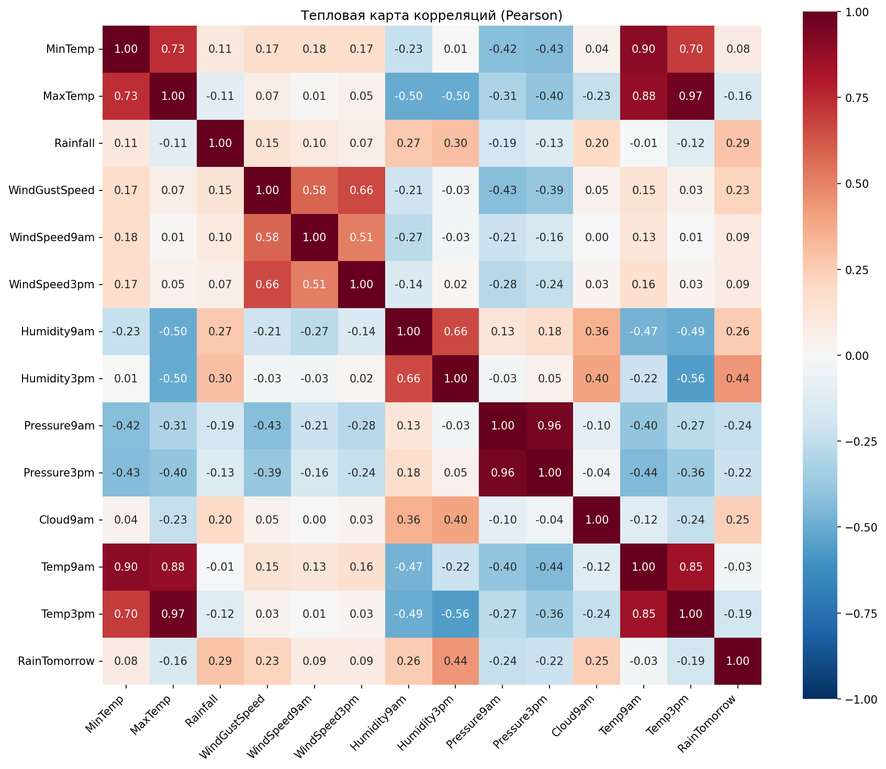

*Рисунок 1 — Тепловая карта корреляций Пирсона.* По осям — числовые признаки и RainTomorrow (0/1). В ячейке — коэффициент корреляции; цвет от синего (отрицательная связь) через белый (0) к красному (положительная). Видны наиболее сильные связи с целью и мультиколлинеарность между температурами и между давлениями.

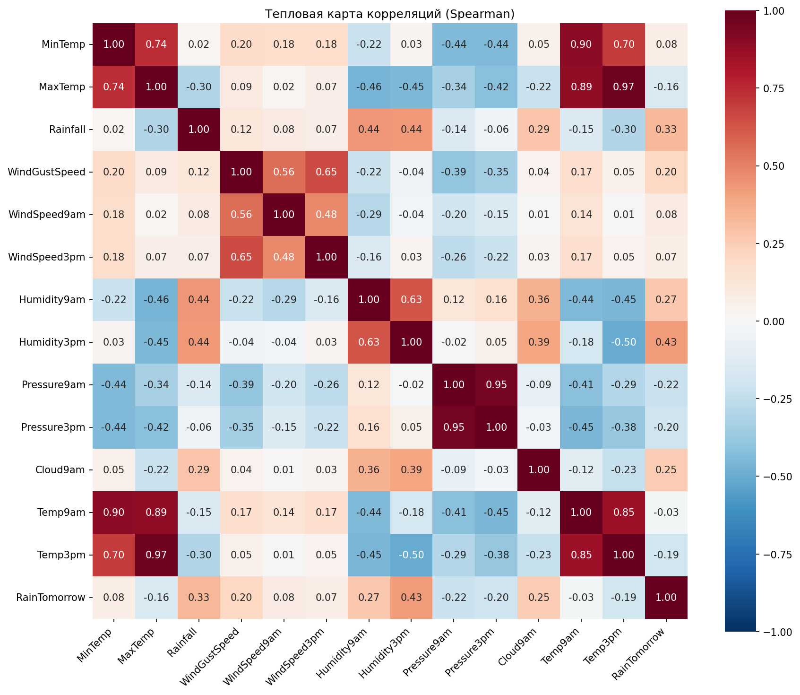

*Рисунок 2 — Тепловая карта корреляций Спирмена.* Та же структура; для скошенных переменных (например, Rainfall) Спирмен часто даёт более устойчивую оценку связи с целью.

**Вывод по заданию 3.** По матрицам видно, какие признаки сильнее всего связаны с RainTomorrow и какие пары признаков дублируют друг друга. Это обосновывает следующий шаг — отбор 2–3 признаков для дальнейшего анализа и классификации.

---

### 2.3. Отбор признаков

После корреляционного анализа выполняется **отбор признаков** для заданий 2, 4, 6 и 7.

**Метод.** Если в конфигурации не задан фиксированный список признаков, выбираются **топ-K** числовых признаков по модулю корреляции Пирсона с RainTomorrow (по умолчанию K = 3). В консоль выводится корреляция каждого числового признака с целью и явно перечисляются выбранные признаки с их |r|.

**Типичный результат.** Выбираются **Humidity3pm** (|r| ≈ 0,44), **Rainfall** (|r| ≈ 0,29–0,33), **Humidity9am** (|r| ≈ 0,26–0,27). Эти три признака далее используются единообразно в визуализации, регрессии, ANOVA и во всех классификаторах.

**Вывод.** Отбор признаков выполняется один раз, обоснование (корреляция с целью) явно выводится в отчёт программы. Все последующие этапы используют один и тот же набор признаков, что обеспечивает согласованность анализа.

---

### 2.4. Задание 2. Визуализация и описательная статистика выбранных признаков

Для **каждого выбранного признака** (Humidity3pm, Rainfall, Humidity9am) строятся:

- распределение по классам RainTomorrow (гистограммы с выделением No/Yes);
- описательная статистика (среднее, медиана, СКО) по всей выборке и по классам;
- разбивка «выше медианы» / «ниже медианы» по данному признаку: гистограмма и boxplot по классам RainTomorrow.

Дополнительно строится график **баланса классов** (столбчатая и круговая диаграммы).

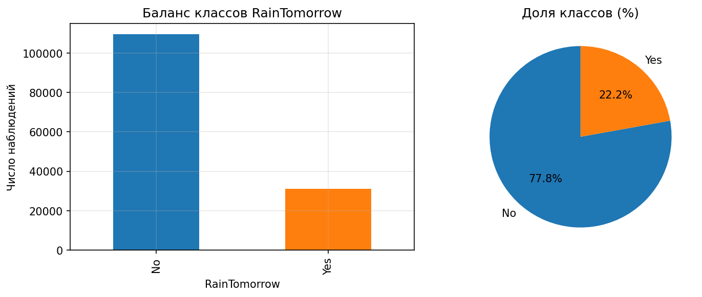

*Рисунок 3 — Баланс классов целевой переменной.* Доля No около 77,8%, Yes около 22,2%.

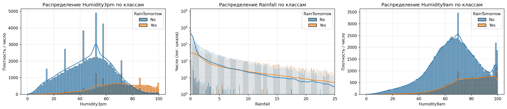

*Рисунок 4 — Распределения Humidity3pm, Rainfall и Humidity9am по классам RainTomorrow.* Для дней с дождём завтра (Yes) влажность выше, осадки чаще ненулевые; для No — влажность ниже, осадки часто 0.

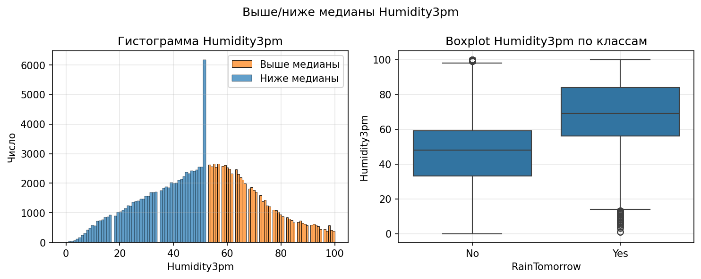  
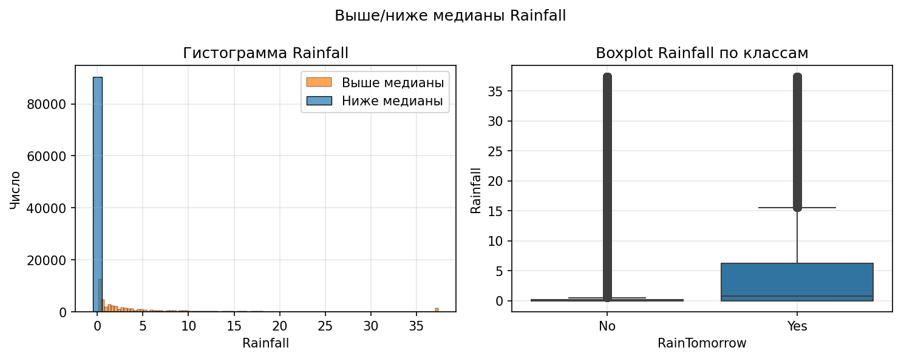  
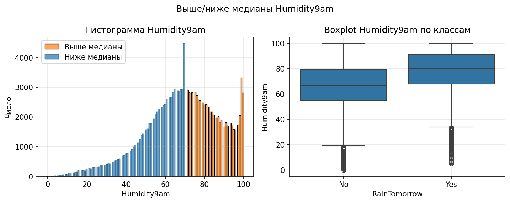

*Рисунки 5–7 — Разбивка по медиане для каждого признака: гистограмма и boxplot по классам.* Подтверждают, что выбранные признаки по-разному распределены в группах «дождь завтра» и «нет дождя».

**Вывод по заданию 2.** Визуализация и описательная статистика показывают, что три выбранных признака содержательны для предсказания RainTomorrow: более высокая влажность (особенно в 15:00) и ненулевые осадки сегодня связаны с классом Yes. Учтены асимметрия распределения Rainfall (медиана 0) и дисбаланс классов.

---

## 3. Часть 2. Моделирование и проверка гипотез

### 3.1. Задание 4. Регрессионный анализ

Для выбранных признаков строятся **простые линейные регрессии** между всеми уникальными парами (каждая переменная по очереди выступает зависимой и объясняющей). Разбиение 70% обучающая / 30% тестовая выборка со стратификацией по RainTomorrow.

Для каждой регрессии вычисляются R² (на train и test), MSE и RMSE на тесте, при необходимости — значимость коэффициентов (OLS, statsmodels). Строится график **остатков** (по оси X — предсказанные значения, по Y — остаток) для оценки гомоскедастичности и линейности.

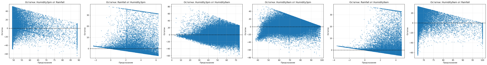

*Рисунок 8 — Остатки регрессий по парам выбранных признаков.* По остаткам видна гетероскедастичность: разброс ошибок не постоянен (например, при предсказании Rainfall дисперсия остатков растёт с ростом предсказания). Это ограничивает применимость стандартных доверительных интервалов OLS.

**Результаты.** R² между признаками обычно невысоки (порядка 0,07–0,45): связь между влажностью и осадками есть, но не строго линейная. Наибольший R² — у пары Humidity3pm и Humidity9am (линейная связь заметнее).

**Вывод по заданию 4.** Простая линейная регрессия даёт лишь грубую оценку связи между выбранными признаками. Низкие R² и вид остатков указывают на нелинейность и гетероскедастичность; для более адекватного описания могли бы потребоваться нелинейные модели или преобразования переменных.

---

### 3.2. Задание 6. Дисперсионный анализ (ANOVA)

Для **каждого выбранного признака** проверяется гипотеза: различаются ли средние значения этого признака между классами RainTomorrow (No / Yes).

- Формируются две группы по значению целевой переменной.
- Проверяется предпосылка однородности дисперсий (тест Левена).
- Выполняется однофакторный ANOVA (F, p-value), вычисляется размер эффекта **eta-squared** (доля дисперсии признака, объяснённая классом).

При двух группах (Yes/No) ANOVA по смыслу эквивалентна двухвыборочному t-критерию.

**Результаты.** Для Humidity3pm, Rainfall и Humidity9am p-value получается крайне малым (порядка 0,0000), F-статистика большой — средние значимо различаются между классами. Наибольший eta² обычно у Humidity3pm (порядка 0,19–0,20), затем Rainfall и Humidity9am. Предпосылка однородности дисперсий может нарушаться (тест Левена значим), что типично для таких данных и учитывается при интерпретации.

**Вывод по заданию 6.** Все три выбранных признака статистически значимо различаются по средним между «дождь завтра» и «нет дождя». Это согласуется с их выбором по корреляции и с визуализациями задания 2.

---

### 3.3. Задание 7. Классификаторы и сравнение моделей

Для предсказания RainTomorrow по выбранным признакам (2–3 столбца) обучаются **четыре модели**:

1. **Логистическая регрессия** (с `class_weight='balanced'`).
2. **Дерево решений** — глубина выбирается по перебору с 5-fold CV (оптимум по AUC).
3. **Случайный лес** — перебор комбинаций `max_depth` и `n_estimators` по 5-fold CV (оптимум по AUC).
4. **MLP (многослойный перцептрон)** — перебор архитектур скрытых слоёв и числа эпох по 5-fold CV (оптимум по F1 или AUC).

**Общие условия.**

- Разбиение 70% / 30% со стратификацией по целевой переменной.
- Признаки масштабируются (StandardScaler) на обучающей выборке, тест масштабируется теми же параметрами.
- Для борьбы с дисбалансом: **SMOTE** на обучающей выборке (синтетические примеры класса Yes) и **class_weight='balanced'** у логистической регрессии, дерева и леса.

**Выбор гиперпараметров.**

- **Дерево:** перебор `max_depth` от 1 до 20 по 5-fold CV; оптимальная глубина выбирается по **AUC** (в отчёте также выводятся оптимальные по F1 для сравнения). Строится график зависимости F1 и AUC от глубины.
- **Случайный лес:** сетка по `max_depth` (например, 4, 8, 16, 20) и `n_estimators` (50, 300); по 5-fold CV выбирается комбинация с наилучшим AUC. Результаты визуализируются в виде тепловых карт F1 и AUC.
- **MLP:** сетка по `hidden_layer_sizes` (адаптирована под малое число входных признаков: (3,), (5,), (10,), (20,), (10,5), (3,2)) и `max_iter` (100, 500). Выбирается конфигурация с наилучшим F1 (или AUC) по 5-fold CV. Строится тепловая карта F1 по комбинациям нейроны × эпохи.

После выбора гиперпараметров все четыре модели обучаются с оптимальными настройками; на тестовой выборке вычисляются: матрица ошибок, Accuracy, Precision, Recall, F1, ROC-AUC, AUC-PR (average precision), выводятся отчёт по классам (classification_report) и сводная таблица. Строятся **ROC-кривые** для всех четырёх моделей.

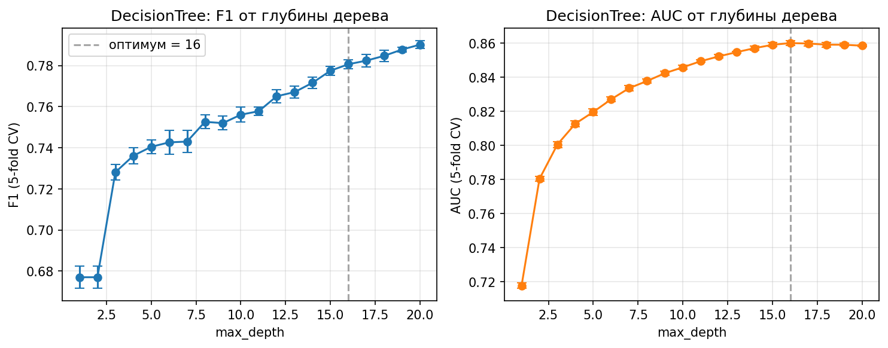

*Рисунок 9 — Зависимость F1 и AUC от max_depth (5-fold CV).* Оптимум по AUC отмечается вертикальной линией (например, глубина 16); по F1 максимум может достигаться при большей глубине, но для снижения переобучения выбирается глубина по AUC.

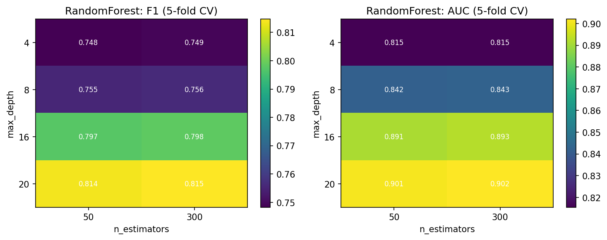

*Рисунок 10 — Тепловые карты F1 и AUC случайного леса (5-fold CV) по комбинациям max_depth и n_estimators.* По ним выбираются наилучшие глубина и число деревьев.

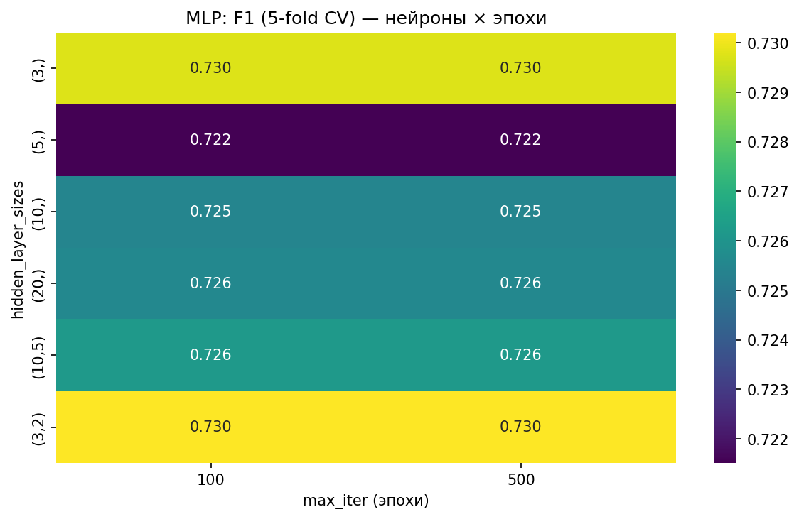

*Рисунок 11 — Тепловая карта F1 MLP (5-fold CV) по комбинациям hidden_layer_sizes и max_iter.* Для малого числа признаков часто лучшие результаты дают небольшие сети (например, (3,) или (3,2)); увеличение эпох с 100 до 500 может не давать прироста, что говорит о достаточной сходимости.

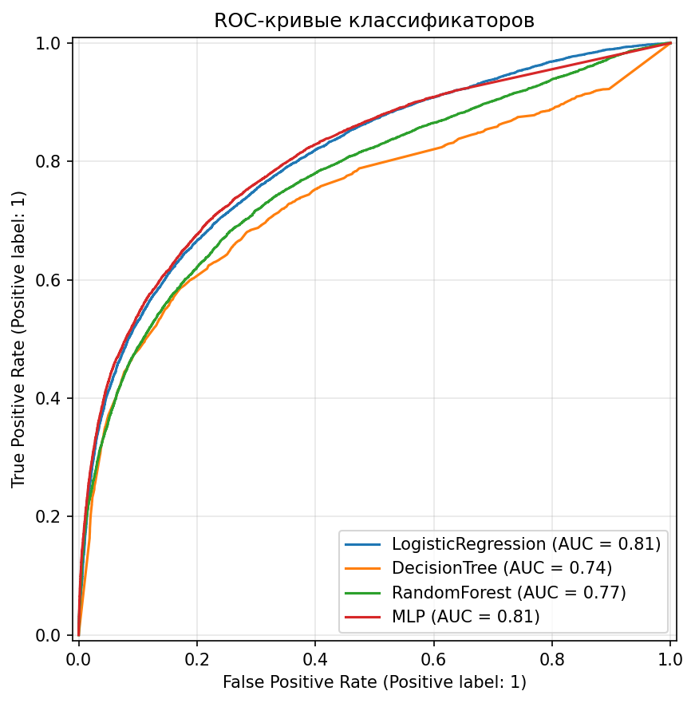

*Рисунок 12 — ROC-кривые четырёх классификаторов на тестовой выборке.* В легенде указан AUC (single split). Чем выше кривая и ближе к верхнему левому углу, тем лучше модель разделяет классы при разном пороге.

**Проверка на смещение к большинству класса.**

Чтобы убедиться, что модели не «подстраиваются» под класс No, выполняются две проверки:

1. **Только объекты с фактическим классом Yes** (дождь завтра): для каждой модели выводится доля предсказаний «Yes» на этой подвыборке. Если модель не мухлюет, эта доля должна быть существенно выше нуля.
2. **Только объекты с фактическим классом No**: выводится доля предсказаний «Yes» на этой подвыборке. Разумная модель здесь должна чаще предсказывать No, т.е. доля Yes не должна быть слишком высокой.

По результатам типичного запуска на подвыборке «только Yes» все четыре модели дают заметную долю предсказаний Yes (порядка 40–70%), а на подвыборке «только No» — меньшую долю Yes (порядка 15–35%), что указывает на осмысленное использование признаков, а не на тривиальное предсказание большинства класса.

**Сводная таблица.** В консоль выводится таблица с колонками: Модель, Accuracy, F1 (split), F1 (CV), ROC-AUC (CV), AUC-PR. Ориентироваться при сравнении моделей следует на F1 (CV), ROC-AUC (CV) и AUC-PR, так как они устойчивее к дисбалансу, чем Accuracy.

**Вывод по заданию 7.** Четыре классификатора с балансировкой и перебором гиперпараметров по 5-fold CV дают устойчивые оценки. Дерево и лес ограничиваются по глубине/размеру для снижения переобучения; MLP на 2–3 признаках достаточно реализовать компактными архитектурами. Проверки на подвыборках Yes/No показывают, что модели не сводятся к предсказанию только No. Для отчёта и выводов основное внимание — на F1, ROC-AUC и AUC-PR, а не только на Accuracy.

---

## 4. Заключение

В работе реализован полный цикл анализа по курсовому заданию:

1. **Первичная обработка** — загрузка, проверка пропусков, дубликатов и аномалий по естественным диапазонам числовых признаков; стратегия очистки и winsorization сохраняет баланс классов и информативность признаков.
2. **Корреляционный анализ** по всем числовым признакам (Пирсон и Спирмен) с выявлением мультиколлинеарности.
3. **Отбор признаков** — топ-3 по модулю корреляции Пирсона с RainTomorrow (как правило, Humidity3pm, Rainfall, Humidity9am) с явным обоснованием в выводе программы.
4. **Визуализация и описательная статистика** только по выбранным признакам; подтверждена их связь с целевой переменной.
5. **Регрессионный анализ** — простые линейные регрессии между парами выбранных признаков; низкие R² и вид остатков отражают нелинейность и гетероскедастичность.
6. **ANOVA** по каждому выбранному признаку — средние значимо различаются между классами RainTomorrow (p ≈ 0, наибольший эффект у Humidity3pm).
7. **Классификация** — четыре модели (логистическая регрессия, дерево решений, случайный лес, MLP) с перебором гиперпараметров по 5-fold CV, балансировкой (SMOTE, class_weight) и проверкой на подвыборках Yes/No. Сравнение по F1 (CV), ROC-AUC (CV) и AUC-PR.

Структура кода (preprocessing → correlation → feature selection → visualization, regression, ANOVA, classifiers) обеспечивает единообразие используемых признаков и понятную последовательность этапов. Результаты подходят для оформления курсовой работы и защиты.

---

## 5. Приложения

### 5.1. Структура кода (каталог course_work)

| Каталог/файл | Назначение |
|--------------|------------|
| `config.py` | Пути, целевая переменная, размер теста, CV, число признаков топ-N |
| `main.py` | Запуск пайплайна: задание 1 → 3 → отбор признаков → 2 → 4 → 6 → 7 |
| `preprocessing/loading.py` | Загрузка CSV, проверка пропусков, дубликатов, аномалий |
| `preprocessing/cleaning.py` | Удаление столбцов/строк, импутация, winsorization |
| `preprocessing/utils.py` | winsorize_iqr, winsorize_rainfall |
| `analysis/correlation.py` | Тепловые карты Пирсон/Спирмен, связь с целью, мультиколлинеарность |
| `analysis/feature_selection.py` | Выбор топ-N признаков по \|r\| с целью |
| `analysis/visualization.py` | Задание 2: распределения, выше/ниже медианы, баланс классов |
| `analysis/regression.py` | Задание 4: регрессии по парам признаков, остатки |
| `analysis/anova.py` | Задание 6: ANOVA по каждому выбранному признаку |
| `classifiers/common.py` | prepare_xy, SMOTE, train/test split, метрики, CV |
| `classifiers/logistic.py` | Логистическая регрессия |
| `classifiers/tree.py` | Поиск оптимальной глубины, обучение дерева |
| `classifiers/forest.py` | Поиск оптимальных max_depth и n_estimators, обучение леса |
| `classifiers/neural.py` | Перебор архитектур и эпох MLP, обучение MLP |
| `classifiers/comparison.py` | Задание 7: запуск всех моделей, сводная таблица, ROC, проверки Yes/No |
| `data/` | Файл weatherAUS.csv |
| `figures/` | Сохранённые графики (task2_*, task3_*, task4_*, task7_*) |

**Запуск:** из корня репозитория: `python -m course_work.main`.

### 5.2. Файлы в каталоге текст

- **ОТЧЕТ_ПО_РАБОТЕ.md** — данный отчёт.
- **ИНТЕРПРЕТАЦИЯ_ГРАФИКОВ.md** — краткое объяснение графиков для неспециалистов.
- **ОТЧЕТ_КУРСОВАЯ.md** — расширенный отчёт в формате курсовой (при необходимости можно объединить с данным документом).
- **ХОД_РАБОТЫ.md** — журнал хода работы (при наличии).
