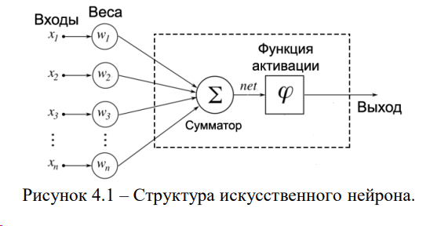
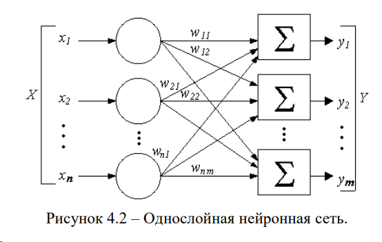
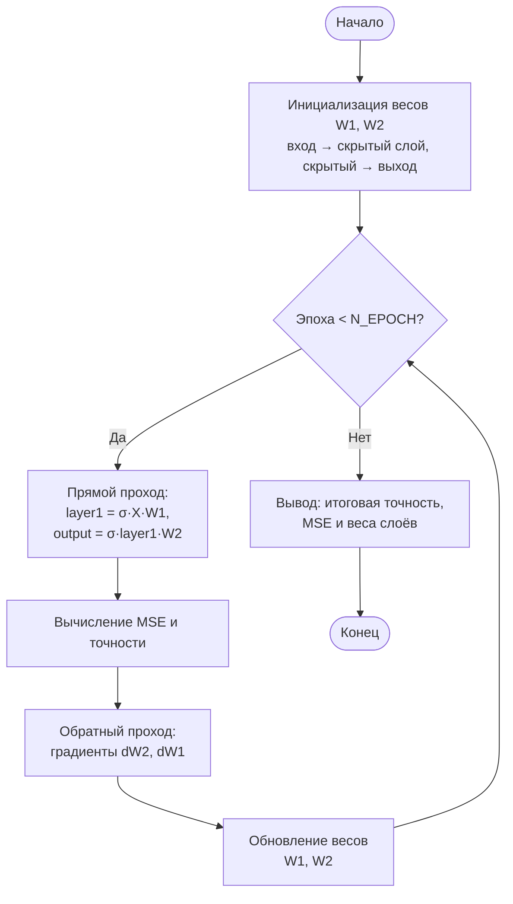

# Лабораторная работа 4. Нейронные сети

*(Титульный лист оформляется отдельно по требованиям кафедры.)*

---

## 1. Цель работы

Создание простейшей нейронной сети на Python без использования специализированных библиотек (только numpy); реализация искусственного нейрона с функцией активации сигмоидой, прямого и обратного распространения, обучение по среднеквадратичной ошибке (MSE), расчёт точности, построение графиков зависимости потерь и точности от номера эпохи, подбор числа нейронов и эпох обучения.

---

## 2. Основные теоретические положения

**Искусственный нейрон (ИН)** — вычислительная единица: на вход поступают сигналы x₁, x₂, …, xₙ; каждый умножается на весовой коэффициент wᵢ и суммируется. Полученная взвешенная сумма (net) подаётся на **функцию активации**; результат — выход нейрона. Формула: net = Σ xᵢwᵢ (и часто добавляют смещение b); выход = σ(net), где σ — функция активации.



*Рисунок 4.1 – Структура искусственного нейрона*

**Функция активации** — преобразует net в выход нейрона. Простейшая: единичный скачок (0 или 1 по порогу). **Сигмоида** σ(z) = 1 / (1 + e⁻ᶻ) даёт выход в диапазоне (0, 1); производная σ'(p) = p(1 − p) используется при обратном распространении.

**Нейронная сеть** — набор нейронов, сгруппированных по слоям. В **однослойной** сети сигналы с входов сразу подаются на выходной слой нейронов (рис. 4.2); в реализованной схеме добавлен один **скрытый слой**: вход → скрытый слой (несколько нейронов с сигмоидой) → один выходной нейрон (сигмоида). Входы не считаются отдельным «слоем» в смысле нейронов.



*Рисунок 4.2 – Однослойная нейронная сеть*

**Обучение нейронной сети** — поиск такого набора весов (и смещений), при котором выход сети с минимальной ошибкой приближается к целевому. **Прямое распространение (feedforward):** по текущим весам вычисляются выходы слоёв. **Обратное распространение (backprop):** по градиенту функции потерь (MSE) относительно весов корректируются веса (градиентный спуск или его вариант). Один проход по всей выборке с обновлением весов — одна **эпоха**.

**MSE (среднеквадратичная ошибка)** = (1/n) Σ (y − ŷ)², где y — целевая метка, ŷ — выход сети. Минимизация MSE приводит к приближению выхода к меткам класса (0 или 1).

**Точность** — доля объектов, для которых предсказанный класс (например, ŷ ≥ 0.5 → класс 1) совпадает с истинным.

---

## 3. Ход работы

**1.** Создан скрипт с импортом numpy и matplotlib. Реализованы функция активации сигмоиды и её производная (для backprop).

**2.** Реализован класс нейронной сети: инициализация весов случайными значениями (вход → скрытый слой, скрытый → выход), метод прямого распространения (feedforward) с сигмоидой по слоям, метод обратного распространения (backprop) с обновлением весов по градиенту MSE.

**3.** Подключён генератор данных из lab1 (norm_dataset). Сформирована выборка с метками Y в форме (n_samples, 1). Сеть инициализирована на этих данных.

**4.** В цикле по эпохам выполняется: прямой проход, расчёт MSE и точности, запись в историю, один шаг обучения (train_step: feedforward + backprop). Выведены итоговая точность и MSE на обучающей выборке.

**5.** Веса первого и второго слоёв вынесены в отдельные переменные (weights_layer1, weights_layer2) для отчёта.

**6.** Построены графики зависимости MSE и точности от номера эпохи; сохранены в lab4/figures/lab4_loss_accuracy.png.

**7.** Выполнена оценка на тестовой выборке: данные разбиты 70% / 30%; сеть обучена на 70%; для 30% вызван метод test(Xtest); выведены точность на обучающей и тестовой выборках.

**8.** Проведён подбор числа нейронов в скрытом слое (2, 4, 8, 16) и числа эпох (30, 50, 100); для каждой комбинации обучение на всей выборке и расчёт финальной точности; выбрана комбинация с максимальной точностью. Результаты выведены в консоль и занесены в отчёт.

---

## 4. Структура нейронной сети и блок-схема

Структура: **входной вектор** (признаки, без слоя нейронов) → **скрытый слой** (n_neuro нейронов, активация — сигмоида) → **выходной слой** (1 нейрон, сигмоида) → **выход** (значение от 0 до 1).

Блок-схема алгоритма обучения:



*Рисунок 4.3 – Блок-схема алгоритма обучения нейронной сети*

**Соответствие коду:** инициализация весов — в `NeuralNetwork.__init__` (weights1, weights2); цикл по эпохам — `for i in range(N_EPOCH)` в main.py; на каждой итерации: прямой проход — `feedforward()` (layer1 = σ(X·W1), output = σ(layer1·W2) в model.py), вычисление MSE и точности — `mse_loss`, `accuracy`, обратный проход и обновление весов — `train_step()` вызывает `backprop()` (градиенты и обновление W1, W2); после цикла — вывод точности, MSE и весов.

Текстовое описание шагов:
1. Инициализация весов W1 (вход → скрытый), W2 (скрытый → выход).
2. Для каждой эпохи: для всех объектов (или батчем) — прямой проход (X → layer1 = σ(X·W1) → layer2 = σ(layer1·W2) = output); вычисление MSE и точности; обратный проход (градиенты по W2, W1; обновление весов).
3. Повтор до заданного числа эпох.
4. Вывод итоговой точности, MSE и весов.

---

## 5. Значения весов НС на каждом из слоёв

После обучения (основной запуск: 4 нейрона, 50 эпох) получены следующие веса:

- **weights_layer1** — веса между входом и скрытым слоем, shape (3, 4):

|       | Нейрон 1   | Нейрон 2    | Нейрон 3    | Нейрон 4    |
|-------|------------|-------------|-------------|-------------|
| x₁    | 2,44       | −11,37      | −0,32       | −18,89      |
| x₂    | −23,52     | −20,53      | −7,98       | −6,42       |
| x₃    | −22,87     | −9,24       | −11,06      | 23,43       |

- **weights_layer2** — веса между скрытым слоем и выходом, shape (4, 1): [−79,42; −72,61; −38,85; −92,79]ᵀ.

Полная распечатка из консоли (основной запуск):

```
Веса первого слоя (вход -> скрытый), shape (3, 4):
[[  2.43638802 -11.37392992  -0.31702174 -18.89361224]
 [-23.52123453 -20.53451999  -7.98228105  -6.419407  ]
 [-22.87173753  -9.24160566 -11.06315331  23.4349874 ]]

Веса второго слоя (скрытый -> выход), shape (4, 1):
[[-79.4180004 ]
 [-72.61031834]
 [-38.84734993]
 [-92.78662346]]
```

---

## 6. Результаты обучения: графики и итоговая точность

### Графики (подписи к рисункам)

**Рисунок 1** — Зависимость среднеквадратичной ошибки (MSE) от номера эпохи на обучающей выборке. По оси X — номер эпохи, по оси Y — MSE. Ожидается уменьшение ошибки с ростом эпохи (при корректном градиенте и шаге обучения).

**Рисунок 2** — Зависимость точности (в %) от номера эпохи на обучающей выборке. По оси X — номер эпохи, по оси Y — точность, %. Ожидается рост точности с увеличением числа эпох.

Файл: `lab4/figures/lab4_loss_accuracy.png` (два графика на одном рисунке).

### Ход обучения по эпохам (фрагмент вывода программы)

| Эпоха | Loss (MSE) | Точность, % |
|-------|------------|-------------|
| 1     | 0,3065     | 50,00       |
| 10    | 0,1568     | 83,95       |
| 20    | 0,1528     | 81,85       |
| 30    | 0,1560     | 84,75       |
| 40    | 0,1532     | 83,10       |
| 50    | 0,1526     | 80,55       |

### Анализ графиков

По таблице и графикам видно: **MSE** после начального снижения (эпоха 1 → 10) выходит на плато около 0,15; **точность** растёт до ~84 % к 10–30-й эпохе, затем колеблется в районе 80–85 %. Это типичная картина: ошибка стабилизируется, а точность (дискретная метрика по порогу 0,5) может немного «дрожать» от эпохи к эпохе. Резкого переобучения (рост MSE, падение точности) не наблюдается, но и существенного улучшения после 20–30 эпох нет — дальнейшее обучение почти не меняет результат.

### Вывод по графикам

**График функции потерь (MSE):** в начале обучения ошибка составляет около 0,3; на 1–2-й эпохе наблюдается кратковременный всплеск MSE (до ~0,5), что может быть связано с резким изменением весов после первых обновлений. Далее MSE быстро снижается и к 5–7-й эпохе опускается ниже 0,2. Примерно с 10-й эпохи кривая выходит на плато: MSE стабилизируется в диапазоне 0,15–0,16 и до 50-й эпохи меняется незначительно. Обучение по критерию MSE можно считать сошедшимся.

**График точности:** точность стартует с уровня случайного угадывания (~50 %) и за первые 5–10 эпох быстро растёт до 80–85 %. К 10-й эпохе достигается максимум (~84–85 %); далее метрика держится на высоком уровне с небольшими колебаниями в пределах 80–85 % и к 50-й эпохе составляет около 80–81 %. Явных признаков переобучения (устойчивое падение точности при продолжении обучения) или недообучения на графике нет: модель осваивает обучающую выборку за 10–15 эпох и затем работает стабильно.

**Итог:** графики показывают быструю сходимость в начале обучения и выход на стабильный режим после 10–15 эпох. Увеличение числа эпох сверх 20–30 даёт малый выигрыш; разумно ограничивать обучение этим диапазоном или ориентироваться на плато MSE и точности при выборе числа эпох.

### Итоговая точность модели

- **На обучающей выборке (основной запуск, 50 эпох, 4 нейрона, вся выборка):** точность **78,60 %**, MSE **0,1551**.
- **Блок 70/30 (сеть 4 нейрона, 50 эпох, обучение только на 70 %):** точность на train **50,43 %**, на test **49,00 %**.

При обучении на 70 % данных та же конфигурация (4 нейрона) в этом запуске не обучается: точность на train и test около 50 % (уровень случайного угадывания). Это показывает **сильную зависимость от объёма обучающей выборки и инициализации**: на уменьшенной выборке часть конфигураций «застревает» в плохом минимуме. Поэтому подбор гиперпараметров нужно проводить с оценкой по **тестовой** выборке (см. п. 7).

---

## 7. Результаты подбора числа нейронов и эпох (оценка по тестовой выборке)

Перебирались комбинации: нейронов — 2, 4, 8, 16; эпох — 30, 50, 100. Для каждой комбинации обучение только на **70 %** данных (train), оценка точности на **30 %** (test) методом `test(Xtest)`. Лучшая конфигурация выбирается по **тестовой** точности.

| Число нейронов | 30 эпох (train / test) | 50 эпох (train / test) | 100 эпох (train / test) |
|----------------|------------------------|------------------------|--------------------------|
| 2              | 53,9 % / 54,3 %        | 54,5 % / 55,8 %        | 64,8 % / **67,7 %**      |
| 4              | 50,4 % / 49,0 %        | 50,4 % / 49,0 %        | 50,4 % / 49,0 %          |
| 8              | **71,9 % / 69,5 %**    | 58,8 % / 57,2 %        | 56,8 % / 54,7 %          |
| 16             | 50,4 % / 49,0 %        | 50,4 % / 49,0 %        | 50,4 % / 49,0 %          |

**Наилучшая комбинация по тестовой точности:** нейронов = **8**, эпох = **30**, test = **69,50 %** (train 71,86 %).

**Выводы по подбору:** При оценке по **тестовой** выборке картина меняется по сравнению с обучением на всей выборке. **8 нейронов, 30 эпох** дают наилучшую тестовую точность (69,50 %) и небольшой разрыв с обучающей (71,86 %) — приемлемое обобщение. **2 нейрона** — недостаточная ёмкость, но с ростом эпох качество растёт (до 67,67 % на тесте при 100 эпохах). **4 и 16 нейронов** в данном запуске при обучении на 70 % данных не обучаются: точность на train и test остаётся около 50 % (сеть «застревает» в плохом минимуме из‑за инициализации или размера выборки). Таким образом, **оптимальная конфигурация при честной оценке по тесту — 8 нейронов, 30 эпох**; выбор лучшей архитектуры по обучающей или полной выборке может приводить к другим результатам и не гарантирует лучшего качества на новых данных.

---

## 8. Выводы по работе

В работе реализована простейшая нейронная сеть с одним скрытым слоем и сигмоидой без использования библиотек глубокого обучения. Реализованы прямое распространение и обратное распространение по градиенту MSE; обучение проводится на данных, сгенерированных генератором из lab1.

**По результатам экспериментов:**

1. **Сходимость обучения (на полной выборке):** MSE снижается в первые эпохи и выходит на плато (~0,15); точность на обучающей выборке при 4 нейронах достигает 80–84 %. Дальнейшее увеличение числа эпох (до 50) не даёт устойчивого прироста.

2. **Подбор архитектуры — два сценария:**
   - **Обучение на всей выборке, оценка на ней же:** лучший результат давали 4 нейрона, 30 эпох (83,60 %); при 8 и 16 нейронах точность падала (переобучение или плохой минимум).
   - **Обучение на 70 %, оценка на 30 % теста:** лучшая **тестовая** точность — **8 нейронов, 30 эпох (69,50 %)**. При 4 и 16 нейронах в этом запуске сеть не обучается (train и test ≈ 50 %); при 2 нейронах точность растёт с числом эпох (до 67,67 % на тесте при 100 эпохах). Итог: при честной оценке по тесту оптимальна конфигурация **8 нейронов, 30 эпох**; выводы по полной выборке и по тестовой могут различаться.

3. **Оценка на отложенной выборке (70/30):** Сеть с 4 нейронами, обученная только на 70 % данных, в данном запуске дала ~50 % на train и test (не обучается). Подбор по **тестовой** точности (п. 7) даёт рабочую конфигурацию (8 нейронов, 30 эпох, 69,50 % на тесте) и показывает, что выбор гиперпараметров по обучающей или полной выборке может быть misleading — нужна оценка по отложенным данным.

4. **Практические аспекты:** Графики MSE и точности по эпохам полезны для выбора числа эпох. Метод test() позволяет оценивать модель на новых данных. Сохранение весов достаточно для воспроизведения сети в другом приложении.

**Итог:** Реализация соответствует заданию. Эксперименты показывают, что оптимальная конфигурация зависит от способа оценки: при оценке по тестовой выборке (обучение на 70 %) лучший результат — 8 нейронов, 30 эпох (69,50 % на тесте); при этом часть конфигураций (4, 16 нейронов) на уменьшенной выборке может не обучаться. Честная оценка по отложенной выборке необходима для выбора модели.

---

## 9. Код программы с пояснениями по этапам

**Структура проекта:** модель нейросети и вспомогательные функции вынесены в отдельные модули; main — точка входа.

**lab4/model.py:** функции sigmoid(Z) и sigmoid_derivative(p). Класс NeuralNetwork: __init__ (веса W1, W2 инициализируются случайно; сохраняются input, y, output); feedforward(X=None) — прямой проход по слоям с сигмоидой, при X=None используются self.input; backprop() — градиенты по выходу и скрытому слою, обновление weights1 и weights2; train_step(X, y) — присвоение input, y, вызов feedforward и backprop; test(X) — вызов feedforward(X) для предсказания на новых данных.

**lab4/utils.py:** accuracy(y_true, pred_proba, threshold=0.5) — приведение к классам по порогу и расчёт доли верных; mse_loss(y_true, pred) — среднеквадратичная ошибка; split_70_30(X, Y, seed) — перемешивание по индексам и разбиение на 70% train / 30% test.

**lab4/main.py:** импорт numpy, matplotlib, Path, NeuralNetwork (из model), accuracy, mse_loss, split_70_30 (из utils); подключение lab1.DataGenerator; задание параметров данных (mu0, mu1, sigma0, sigma1, N), генерация X, Y и приведение Y к (n_samples, 1). Параметры сети: N_NEURONS, N_EPOCH, LEARNING_RATE, SEED. Создание NN, цикл по эпохам: feedforward, расчёт loss и acc, запись в history_loss и history_acc, train_step(X, Y). Вывод итоговой точности и MSE; копирование весов в weights_layer1, weights_layer2 и их вывод. Построение двух графиков (MSE и точность от эпохи), сохранение в figures. Блок 70/30: split_70_30(X, Y), создание новой сети, обучение на Xtrain, Ytrain; вызов test(Xtest), вывод точности на train и test. Подбор: разбиение 70/30 (Xtrain, Ytrain, Xtest, Ytest); циклы по n_neur и n_ep; для каждой пары — новая сеть, обучение на Xtrain, Ytrain, расчёт точности на train (feedforward) и на test (test(Xtest)); выбор лучшей пары по тестовой точности; вывод train/test для каждой конфигурации и оптимальной по тесту.

---

### Файлы lab4 (основные фрагменты)

Полный код см. в репозитории: **lab4/main.py**, **lab4/model.py**, **lab4/utils.py**. Запуск: `python -m lab4.main` из корня проекта leti.
